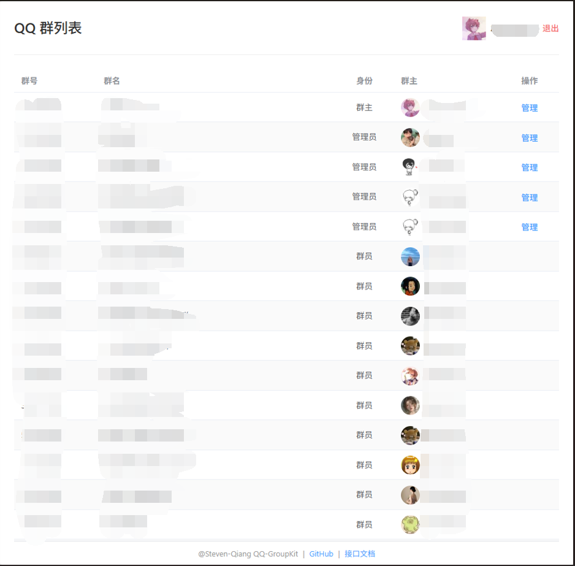
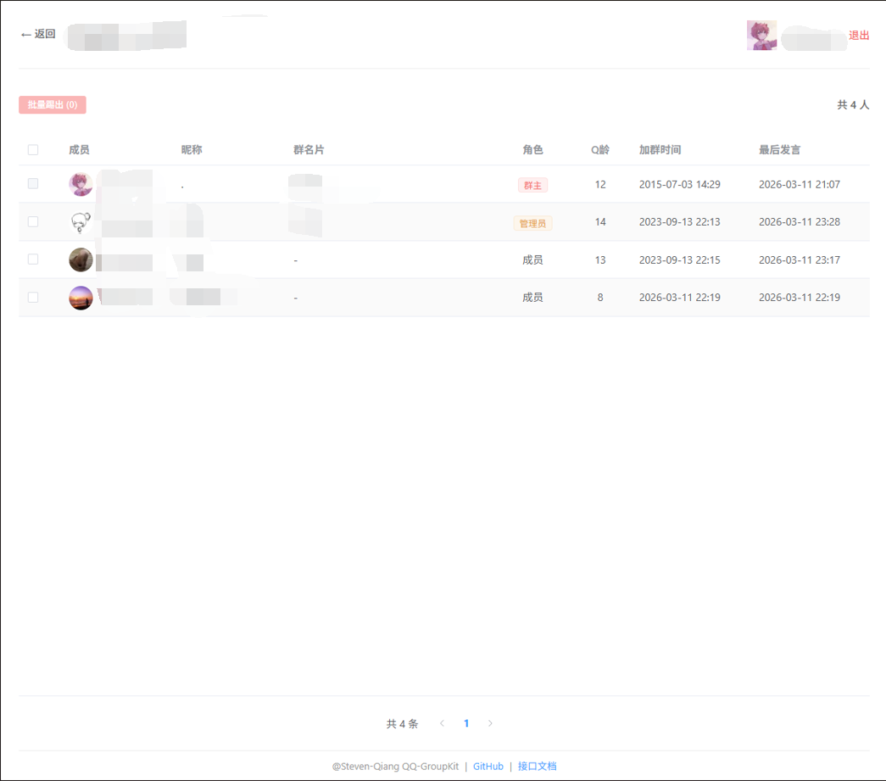
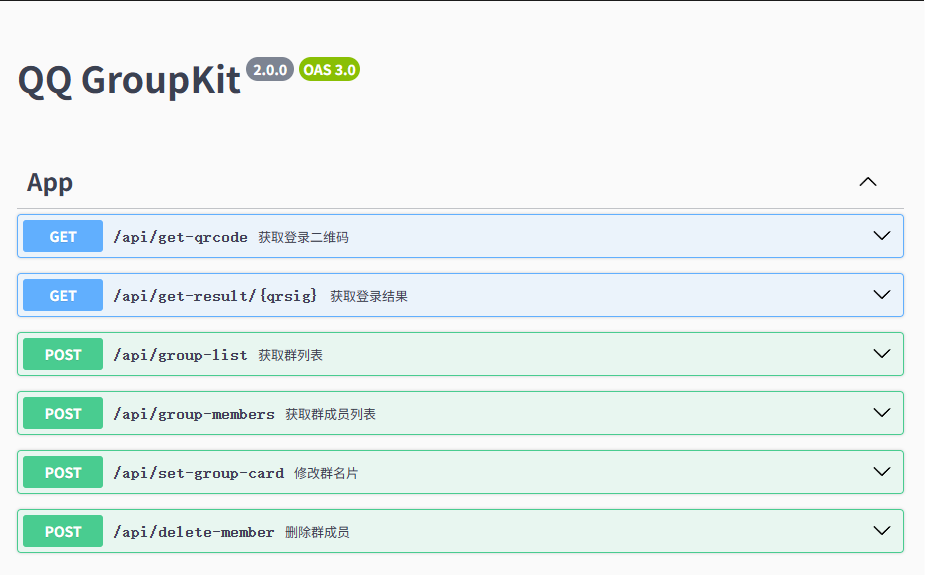

# QQ-WebGroupKit

## 项目简介

提供了网页版的 QQ 群管理功能，提供接口文档。通过扫码登录 QQ 后，可以查看群列表、群成员信息，以及进行一些群管理操作（demo）。

## 功能特点

- **扫码登录**：通过二维码登录 QQ，获取登录凭证
- **群列表管理**：查看用户加入的所有 QQ 群，包括创建的、管理的和加入的群
- **群成员管理**：查看群成员列表，支持设置群名片和移除成员
- **Swagger 接口文档**：提供详细的 API 接口文档

## 技术栈

- **后端**：NestJS、TypeScript、Axios、[qq-login-qrcode](https://github.com/Steven-Qiang/qq-login-qrcode)
- **前端**：Vue 3、TypeScript、Vite、Pinia
- **构建工具**：pnpm、ESLint

## 项目结构

```
├── apps/
│   ├── backend/         # 后端服务
│   │   └── src/
│   │       ├── app.controller.ts    # 控制器
│   │       ├── app.dto.ts           # 数据传输对象
│   │       ├── app.service.ts       # 业务逻辑
│   │       ├── app.module.ts        # 模块定义
│   │       ├── main.ts              # 应用入口
│   │       └── setup-swagger.ts     # Swagger 配置
│   └── frontend/        # 前端应用
│       └── src/
│           ├── api/                 # API 调用
│           ├── components/          # 组件
│           ├── stores/              # 状态管理
│           ├── utils/               # 工具函数
│           ├── views/               # 页面
│           │   ├── LoginPage.vue    # 登录页面
│           │   ├── GroupListPage.vue # 群列表页面
│           │   └── GroupMembersPage.vue # 群成员页面
│           ├── App.vue              # 根组件
│           ├── main.ts              # 应用入口
│           └── router.ts            # 路由配置
├── screenshots/         # 功能截图
├── package.json         # 项目配置
└── pnpm-workspace.yaml  # 工作区配置
```

## 快速开始

### 环境要求

- Node.js 16+
- pnpm

### 安装依赖

```bash
pnpm install
```

### 启动开发服务器

```bash
pnpm dev
```

后端服务默认运行在 `http://localhost:3000`，前端应用默认运行在 `http://localhost:3001`。

### 访问接口文档

启动服务后，可以通过以下地址访问 Swagger 接口文档：

```
http://localhost:3000/api
```

## 功能扩展

该项目仅作为演示，您可以基于此扩展更多功能，例如：

- **扫码验证用户是否在某个群内**：可用于验证授权功能，确保用户是特定群的成员
- **批量管理工具**：批量添加/删除群成员、批量修改群名片
- **群数据统计**：分析群成员活跃度、发言频率等
- **群消息管理**：查看群历史消息、设置群公告等
- **权限管理**：基于群角色的权限控制

## 功能截图

### 登录页面


### 群列表页面



### 群成员页面



### API 文档页面



## 注意事项

- 本项目使用 QQ 官方接口进行操作，请合理使用，避免频繁请求导致账号被限制
- 登录凭证（cookies）及其他用户数据仅存储在前端 localStorage 中，不会保存在服务器端，确保数据安全性
- 本项目仅作为学习和演示用途，请勿用于商业目的

## 许可证

MIT
